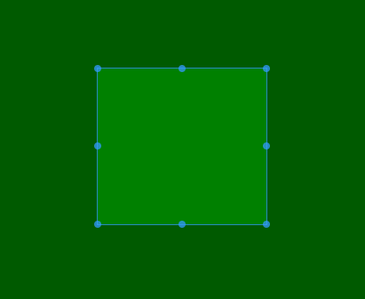

# vue-crop
a simple vue component of croper,  Decoupling with Images, The maximum minimum aspectRatio value can be set.

## LICENSE
[-blue.svg)](https://github.com/996icu/996.ICU/blob/master/LICENSE)

## install & use
npm install --save vue-crop-simple

    import VueCrop from 'vue-crop-simple';
    import 'vue-crop-simple/dist/vue-crop-simple.css';
    Vue.use(VueCrop);

    <vue-crop
        @changed="changeHandler"
        @beforeChange="beforeChangeHandler"
        :init-rect="{x1: 10, x2: 110, y1: 10, y2: 110}"
        :allowStartNewCrop="false"
        :min-height="100"
        :min-width="100"
        :max-width="500"
        :max-height="500">
    </vue-crop>

use in plugin

    import VueCrop from 'vue-crop-simple';
    import 'vue-crop-simple/dist/vue-crop-simple.css';

    // in vue component file
    components: {
        VueCrop
    }

## preview

## props:
+ ### initRect
    Object  
    default {x1: -1, y1: -1, x2: -1, y2: -1}  
    you can set init crop area by this porp
+ ### showRect
    Boolean  
    default true  
    show or hide crop rect
+ ### resizeAble
    Boolean  
    default true  
    set the crop rect resizeable property
+ ### aspectRatio
    Number  
    default undefined  
    set the crop rect aspect radio property. this value makes from width / height
+ ### allowStartNewCrop
    Boolean  
    default true  
    allow draw a new rect(when a rect is showing).
+ ### minWidth
    Number  
    default undefined  
    the min width of crop rect
+ ### maxWidth
    Number  
    default undefined  
    the max width of crop rect
+ ### minHeight
    Number  
    default undefined  
    the min height of crop rect
+ ### maxHeight
    Number  
    default undefined  
    the max height of crop rect
## events:
+ ### beforeChange
    trigger when user is ready to drag the crop rect.
+ ### changed
    trigger when drag end
+ ### created
    trigger when croper component is mounted